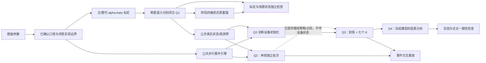

# 小问依赖与检查器接口

## 1. 依赖图

原则：Q2–Q4 复用同一个状态/事件/指标框架；Q3 使用第二批独立设备，年龄、代次和寿命随机流完全重置。Q2 只能提供策略基线和实现证据，不能把结束设备状态传给 Q3。

## 2. 主模型未来输出接口

主模型只产生计划和原始事实，不能自封“验证通过”。路线确认后至少输出：

- `run_manifest.json`：题面参数版本、口径/状态机/标定版本、检查注册表版本、0.5 h 或 1 h 周转情景、策略、K、种子、代码版本和环境；
- `random_key_manifest.json`：主种子、重复编号、键规范版本及真实状态/观测/设备寿命子流命名；不保存依赖事件顺序的随机数位置；明确 `U_Y` 只含 `rep,device,process,effective_attempt_no`，禁止加入 `squad_id/execution_no/restart_no`；
- `calibration_report.json`：显式记录 `observation_semantics`。字面主情景输出每组 `q,e,feasible,alpha,beta` 及可行性残差；标准链替代情景另输出 `c,phi(0),phi(c_max),g_c,dc/de` 和原方程残差；两者各有独立配置哈希；
- `quality_anchor.json`：终局四格闭式概率、`E[S],E[PL],E[PW]`、整机/E条件退出概率及多项分布参数；
- `event_trace.csv`：测试、终端取消、运输、故障、更换、校准、班界、通过和退出事件；
- `attempts.csv`：一行一次物理启动片段，含装置、工序、`effective_attempt_no`、`execution_no/restart_no`、`squad_id`、逻辑释放时刻、开始/结束/中断/取消、结果、真状态、运行片段及完成结果的 `result_squad_id`；同一有效尝试可含多个甚至不同分队的片段；
- `device_outcomes.csv`：A/B/C 状态、`d_created`、D 三态值、观测历史和终局四格类别；
- `equipment_life.csv`：每套/每代设备累计年龄、抽样寿命、故障与更换原因；
- `replication_metrics.csv`：每次重复的 T、S、PL、PW、YXB 和辅助指标；
- `results.csv/json`：只由冻结重复级文件生成的正文数字。

D 使用三态字段：`not_created/normal/problem`。禁止把提前退出装置尚未生成的 D 自动填成“正常”或“有问题”。

## 3. 独立检查器输入与禁区

检查器位于 `04_代码/checker/`，只读：

1. `02_数据/parameters.csv`、签字后的口径/状态机配置；
2. 主模型的原始标定报告、事件日志和结果；
3. 预先写死的手算/极端小例期望。

检查器禁止：

- 导入 `main_model` 的标定求解器、状态转移、动作可行性或指标函数；
- 读取求解器“可行/最优”标记后直接相信；
- 用主模型生成的汇总指标验证同一汇总指标；
- 根据主模型实际结果反向修改期望值或容差。

## 4. 唯一检查注册表

所有检查定义、阶段和失败处置只见 [检查注册表 V3.1](检查注册表_V3.1.md)，版本为 `CR-V3.1`。`CR-V3.0` 仅作历史证据。本文件不再重复检查编号或释义，避免与方案稿发生同号异义。

- G2 使用：`C01–C06,C08–C12,C16–C21,C27` 的 G2 适用部分；
- G3 使用：`C06–C07,C13–C18,C24,C26`；
- H2 专属：`C23–C25`，不属于 G2；
- 论文发布前：`C22,C27`。

## 5. 预定小实例

1. 1 台无异常：A/B/C 在 `t=0` 同时启动，B 在 2 h 完成，A/C 在 2.5 h 完成，随后 E；核对资源与最早终态。
2. 2 台无异常：覆盖两台位竞争四类资源，核对可重复平局规则和并行容量。
3. 一道工序首次异常：该工序进入重测，其他已启动任务继续；核对重测并行和队列键。
4. 某工序第二次异常：核对整机退出、其他在途任务取消、片段计年龄/YXB但无结果。
5. 同一时刻一个任务完成正常、另一个任务第二次异常：先批量结算同刻完成事件，再执行终端取消；改变日志插入顺序不得改变结局。
6. D 未生成即退出：核对 `d_created=false`，PW 只检查已存在的 A/B/C 状态。
7. 故障恰在任务开始/完成、120 h、240 h；另测`a+d<,=,>240`：核对前置换新、区间和事件优先级。
8. 任务恰好班末完成、差最小时间单位无法完成：核对左闭右闭规则和禁启。
9. 0.5 h 与 1 h 周转：相同输入下只允许完成时间/利用率变化，manifest 明确分离。
10. Q3 初始化：故意提供 Q2 末态文件，主模型仍不得读取；七个 K 使用配对的新寿命流。
11. 班末活动：分别给测试、40min校准和1h周转仅剩18min/足时小例；复审口径下不得跨班启动。
12. 质量oracle：使用同一键控真状态/有效观测带，但不读时间日志，逐台复算四格类别；改变合法排程只能改时间日志。
13. Q3 跨班待重测：班1末首败后剩余时间不足以完整重测，任务保持原 `release_time`、`effective_attempt_no=2` 和台位；班2另一分队按全局 FCFS 执行。核查不插队、观测 U 不变、`squad_id` 只出现在物理片段日志。
14. 完整 K=9 三台跨班例：逐事件期望见 [手算样例：K=9 的三台装置跨班重测](手算样例_K9跨班重测.md)，联合验收 `CR-V3.1/C08,C09,C11,C12`。

上述小例的预期事件表必须在执行模型编码前由决策模型和队伍签字。
