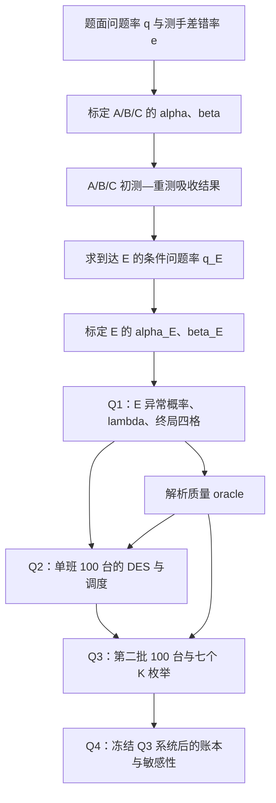

# 大型装置测试任务规划：现有建模思路总说明（队内版 V3.1）

> 适用版本：`CR-V3.1`  
> 更新日期：2026-08-13  
> 文档状态：EXPLANATORY／队内解释稿，不单独授权实现。  
> 用途：供队友理解、讨论和复核当前方案，不是完整论文，也不是结果报告。  
> 状态说明：本文描述 `STATE-2026-08-13-G2.2` 时冻结的模型；实时 Gate 和数字状态只看项目根 `CURRENT_STATE.md`。

## 1. 先用一句话说清我们在做什么

我们的核心思路是：

> 先把“装置真实有没有问题”和“测手实际报什么结果”分开，解析求出每道测试链及整台装置的最终质量结果；再把这套质量模型嵌入一个包含两台位、四类专用设备、A/B/C 并行、设备故障、班界、校准和装置周转的离散事件系统；在证明合法调度不会改变终局质量后，时间层只比较如何更快完成，并在同一系统上完成问题 4 的因素分析。

全文模型可以概括为：

> **固定观测核的无维修可靠性模型 + 终局四格闭式质量锚 + 并行离散事件仿真 + 固定 FCFS 基线 + 有条件准入的后验 rollout + 独立检查器。**

这里最重要的不是模型名字，而是三层必须分开：

1. **真实状态层**：装置到底有没有真实问题；
2. **观测层**：测手这次报正常还是异常；
3. **流程判定层**：装置最终被流程判为通过还是退出。

“真实有问题”不等于“测试报异常”，“流程通过”也不等于“真实完全正常”。`PL`、`PW` 正是用来刻画这种差别。

## 2. 四个问题之间的依赖关系



这条链有两个不能打断的地方：

- E 组不能直接沿用 A/B/C 的原始问题率。必须先算出哪些装置实际能走到 E，以及这些装置中仍有真实问题的比例 `q_E`，再标定 E。
- 主差错语义和替代差错语义不能只替换一组 `alpha、beta`。两套语义都必须从 A/B/C 开始，完整重算 `q_E`、E、终局四格、`lambda`、Q2/Q3 工期和七个 K。

## 3. 题目被形式化成哪些对象

### 3.1 装置和真实状态

- 每台装置有 A、B、C 三个子系统。
- A/B/C 的真实问题状态在装置进入时各生成一次，测试和重测都不改变它们。
- 只有 A/B/C 均被流程判定通过、发生整体联接时，才生成一次联接子系统 D 的真实状态。
- 装置若在 A/B/C 阶段提前退出，D 尚不存在，不能为了计算指标而反事实补抽一个 D。
- 本题没有维修动作。测出异常后只是重测，不意味着问题被修复。

### 3.2 测试结果

对每个专业组 `j∈{A,B,C,E}`，定义：

\[
\alpha_j=P(\text{报告异常}\mid\text{真实正常}),
\]

\[
\beta_j=P(\text{报告正常}\mid\text{真实有问题}).
\]

白话解释：

- `alpha` 是把正常对象“冤枉”为异常的条件概率，即假阳性率；
- `beta` 是把真正有问题的对象漏过去的条件概率，即假阴性率。

### 3.3 流程状态

每道工序只允许以下流程：

```text
初测正常 → 该工序通过
初测异常 → 完整重测同一道工序
重测正常 → 该工序通过
重测仍异常 → 整台装置退出
```

“连续两次未通过”严格指同一道工序的初测异常与其完整重测再次异常。设备故障、班界中断和终态取消都没有检测结果，不算一次异常，也不增加有效尝试号。

### 3.4 时间和资源状态

系统同时跟踪：

- 两个装置驻留台位；
- A/B/C/E 四套单容量专用设备；
- 每台装置的工序、重测、终态和所在台位；
- 每套设备的忙闲、运行年龄、代次、随机寿命、换新和校准；
- 四个全局 FCFS 队列；
- 班次、班界、班外停工和下一事件；
- 装置运出、运入和台位周转。

### 3.5 题面主要数值输入

下表只列题面输入和由题面直接形成的决策域，不是模型运行结果。

| 类别 | A | B | C | E / D | 说明 |
|---|---:|---:|---:|---:|---|
| 单次完整测试时长 | 2.5 h | 2 h | 2.5 h | E：3 h | 初测与重测时长相同 |
| 换新后的校准时长 | 30 min | 20 min | 20 min | E：40 min | 初始时刻四套设备已经校准 |
| A/B/C 真实问题率 | 2.5% | 3% | 2% | D：0.1% | D 只在联接时生成 |
| 测手总体差错率 `e` | 3% | 4% | 2% | E：2% | 误判、漏判各约占一半；解释见第 5 节 |
| 120 h 累计故障概率 | 3% | 4% | 2% | E：3% | 按从 0 开始的累计概率读取 |
| 240 h 累计故障概率 | 5% | 7% | 6% | E：5% | 达 240 h 必须换新 |

其他关键输入：

- 装置运出、运入各需 0.5 h；主周转将二者同槽顺序执行，合计 1 h；
- Q2 为 100 台、每日一班、班长不超过 12 h；
- Q3 为第二批 100 台、每日两班，`K` 在 9—12 h 内以 0.5 h 为步长；
- 每道工序最多形成两次有效完成结果。

## 4. 当前已经冻结的流程口径

下表特意区分题面事实、团队闭合假设和策略限制。论文中也必须按这三类披露，不能把后两类伪装成题面明文。

| 内容 | 当前口径 | 性质 |
|---|---|---|
| 驻留容量 | 两个测试台位，同时最多驻留两台装置 | 题面事实 |
| 专业资源 | A/B/C/E 各一套专用设备，容量均为 1 | 题面事实 |
| A/B/C 并行 | 同一台装置可同时占用不同的 A/B/C 设备测试 | 题面强支持、团队确认 |
| E 前置 | A/B/C 均有效通过后才联接、生成 D，并释放 E | 题面流程及团队精化 |
| 重测 | 首次异常后完整重做同一道工序；E 异常只重做 E，不返回 A/B/C/D | 团队确认的最简自洽解释 |
| 指向性 | E 的指向标签只用于故障来源统计，不改变后续流程 | 团队闭合假设 |
| 维修 | 不维修；重测不改变或重抽真实故障状态 | 题面没有维修，团队明确 |
| 初态 | `t=0` 时首两台已到位，初始四套设备已校准 | 团队初始化闭合 |
| 终点 | 末台得到终端判定立即停止，不计末台运出 | 题面计时口径 |
| 主周转 | 同一台位先运出 0.5 h、再运入 0.5 h，共 1 h | 题面字面主情景 |
| 替代周转 | 同一台位一出一进完全重叠，共 0.5 h | 效率上界敏感性 |
| 班外活动 | 班外测试、运输、换新和校准全部停止 | 团队班历闭合 |
| 活动跨班 | 测试、换新—校准复合服务、台位完整周转都不可跨班 | 团队确认 B18 |
| 班末禁启 | 只有能在本班内完整结束的活动才允许启动；恰好班末结束允许 | 团队操作约束，弱支配尚未证明 |
| 排队规则 | 每类资源使用固定全局 FCFS 键 | 可复现策略限制，不是题面要求 |

班末禁启不能写成已经证明的最优性定理。在允许班尾运行作废片段、并与设备更新策略交互的更大策略空间中，它的弱支配性尚未得到证明。我们采用它，是为了冻结一套清晰、可执行且所有候选策略共同遵守的操作规则。

## 5. 最关键的测手差错模型

### 5.1 字面主情景：一次测试的无条件差错率

当前重新签字后的主情景，把题面“测手发生差错的概率为 `e`，误判、漏判各约占一半”解释为：从问题率为 `q` 的相应测试总体中随机抽取一次测试，假阳性和假阴性各贡献总概率的 `e/2`。因此：

\[
(1-q)\alpha=q\beta=\frac e2,
\]

得到：

\[
\alpha=\frac{e}{2(1-q)},\qquad
\beta=\frac{e}{2q}.
\]

概率必须满足：

\[
e\le 2\min(q,1-q).
\]

如果某组不满足这个条件，正确做法是报告“该字面解释与该组题面参数不相容”，而不是把大于 1 的概率裁剪为 1，也不能用最小二乘硬造一个解。

执行顺序是：

1. 按各自的 `q_A、q_B、q_C` 标定 A/B/C；
2. 根据 A/B/C 的最终通过链求到达 E 的真实问题率 `q_E`；
3. 用 `q_E` 和 `e_E` 标定 E。

### 5.2 关键替代情景：标准初测—触发重测链

替代情景认为，历史差错率的统计总体是一个标准单工序链：每个对象先做初测，只有初测异常才重测；初测和实际触发的重测合在一起，事件级总体差错率为 `e`，FP/FN 各占一半。

该链的期望测试事件数为：

\[
D=1+(1-q)\alpha+q(1-\beta).
\]

期望假阳性、假阴性事件数分别为：

\[
N_{FP}=(1-q)(\alpha+\alpha^2),
\]

\[
N_{FN}=q(2\beta-\beta^2),
\]

并要求：

\[
N_{FP}=N_{FN}=\frac{eD}{2}.
\]

令共同错误量为 `c`，可将二维问题化为一维求根：

\[
\alpha(c)=\frac{\sqrt{1+4c/(1-q)}-1}{2},
\]

\[
\beta(c)=1-\sqrt{1-c/q},
\]

\[
0\le c\le c_{\max}=\min\{2(1-q),q\}.
\]

求根函数为：

\[
\phi(c)=\frac{2c}{e}-\left\{1+(1-q)\alpha(c)+q[1-\beta(c)]\right\}.
\]

该函数在可行域内严格递增，因此可以通过端点符号判断无解、端点唯一解或唯一内点解。G2 中主求解器和独立检查器必须采用不同代码路径回代原方程。

### 5.3 两套语义如何比较

两套语义不是“改一个参数看看”，而是两条完整场景：

```text
A/B/C 标定
  → A/B/C 通过链
  → 到达 E 的状态分布与 q_E
  → E 标定
  → Q1 四格与 lambda
  → Q2/Q3 质量和工期
  → 七个 K
```

不同场景必须使用不同配置哈希、结果目录和运行清单，禁止把主场景的 `q_E` 或下游结果复用到替代场景。

## 6. 问题 1：解析质量模型

本节乘积闭式采用当前主基线的独立性假设：A/B/C 的初始真实状态相互独立，D 与它们独立；给定真实状态后，不同工序及两次有效尝试的观测误差相互独立。若后续做相关缺陷或相关观测敏感性，这些乘积式必须改用相应联合分布；16 状态枚举接口仍可保留，但状态概率不能继续由独立边际概率相乘得到。

### 6.1 单道 A/B/C 工序的最终通过概率

对 `j∈{A,B,C}` 定义：

\[
u_j=1-\alpha_j^2,
\]

表示真实正常时，经过“初测—必要时重测”后最终通过该工序的概率。健康对象只有连续两次假阳性才会退出，因此通过概率为 `1-alpha_j^2`。

\[
v_j=2\beta_j-\beta_j^2,
\]

表示真实有问题时仍最终通过该工序的概率。它包括初测直接漏判，或初测检出后重测又漏判。

总体最终通过该工序的概率为：

\[
g_j=(1-q_j)u_j+q_jv_j.
\]

### 6.2 到达 E 的装置构成

记：

\[
G=\prod_{j=A,B,C}g_j,
\]

\[
Q_0=\prod_{j=A,B,C}(1-q_j),\qquad
U=\prod_{j=A,B,C}u_j.
\]

其中：

- `G` 是装置能够走到综合测试 E 的概率；
- `Q_0` 是 A/B/C 初始都真实正常的概率；
- `U` 是在 A/B/C 都真实正常条件下，三道工序均最终通过的概率。

D 只在装置到达 E 前的联接时生成。于是：

\[
Z_0=(1-q_D)Q_0U,
\]

\[
Z_1=G-Z_0,
\]

\[
q_E=\frac{Z_1}{G}.
\]

白话解释：

- `Z_0` 是“走到 E 且 A/B/C/D 全部真实正常”的无条件概率；
- `Z_1` 是“走到 E 且至少还有一个真实问题”的无条件概率；
- `q_E` 是在实际走到 E 的装置中仍有真实问题的条件比例。

### 6.3 E 初测异常概率与 E 工序退出概率

E 初测报告异常的概率为：

\[
P(E\text{ 初测异常}\mid\text{到达 E})
=q_E(1-\beta_E)+(1-q_E)\alpha_E.
\]

到达 E 后，因 E 连续两次异常而退出 E 工序的概率为：

\[
P(E\text{ 工序退出}\mid\text{到达 E})
=q_E(1-\beta_E)^2+(1-q_E)\alpha_E^2.
\]

第二个式子仍不是整台装置的总体退出概率，因为有些装置已经在 A/B/C 阶段退出。

### 6.4 终局四格

定义四个互斥终局类别：

| 记号 | 含义 |
|---|---|
| `GP` | 真实正常，流程最终通过 |
| `BP` | 仍有真实问题，流程最终通过 |
| `GE` | 真实正常，流程最终退出 |
| `BE` | 真实有问题，流程最终退出 |

令：

\[
u_E=1-\alpha_E^2,\qquad
v_E=2\beta_E-\beta_E^2.
\]

则：

\[
p_{GP}=Z_0u_E,
\]

\[
p_{BP}=Z_1v_E,
\]

\[
p_{GE}=Q_0(1-U)+Z_0\alpha_E^2,
\]

\[
p_{BE}=1-p_{GP}-p_{BP}-p_{GE}.
\]

其中 `p_GE` 的第一项表示 A/B/C 真实都正常，但某道前序工序连续两次假阳性而提前退出；此时尚未联接，D 不存在。第二项表示整台装置真实正常并到达 E，却在 E 连续两次被误判异常。

对 100 台装置：

\[
E[S]=100(p_{GP}+p_{BP}),
\]

\[
E[PL]=p_{BP},\qquad E[PW]=p_{GE}.
\]

这里 `PL、PW` 是“台数除以 100”的率，因此它们的期望等于相应单台概率。这套闭式是 Q2/Q3 质量输出的解析锚，但不提供工期 `T` 的解析答案。

### 6.5 `lambda` 的定义

令到达 E 时的非空真实故障集合为 `H`。主表只统计实际完成的 E 真阳性事件；每个事件总权重为 1，若同时存在多个真实故障，则在集合成员间等权分摊：

\[
\lambda_i=
\frac{
E\!\left[\sum_a I(a\text{ 为 E 真阳性})\,
I(i\in H_a)/|H_a|\right]
}{
E\!\left[\sum_a I(a\text{ 为 E 真阳性})\right]
}.
\]

关键边界：

- 完全正常装置的 E 假阳性没有真实故障来源，不进入主表；
- 多故障等权分摊是团队用于闭合题意的假设，不是题面唯一规定；
- 主 `lambda` 四项严格归一为 1，显示时才可能因四舍五入近似为 1；
- 事件级真阳性计数、仅初测计数和每台至多一次计数并不相等；
- 当前 E 对不同非空故障集合使用同一个 `beta_E`，所以这些计数只相差一个与 `H` 构成无关的公共因子，归一后的来源比例相同。

另报：

\[
\widetilde\lambda_i
=P(i\in H\mid H\ne\varnothing,\text{到达 E}).
\]

它回答“有问题的到达 E 装置中，系统 i 出现问题的概率”，四项之和可以大于 1，不能替代主表 `lambda`。

## 7. 为什么质量与工期可以分开

### 7.1 分布层面的主命题

如果满足以下条件：

- 真实状态生成机制和观测核固定；
- 不维修、不跳测、不加测、没有截止删失；
- 中断和取消不产生检测结果，也不改变真实状态；
- `alpha、beta` 不随时间、疲劳、设备年龄、分队或中断次数变化；
- 设备故障不损伤装置本身；
- 策略不能预知隐藏真相，且公平、几乎必然完成全部必做流程；
- 同刻完成事件先统一结算；

那么，合法排程不会改变装置终局质量分布。原因是排程只决定某次有效测试“什么时候完成”，而每道局部初测—重测链的吸收规则没有改变。

### 7.2 键控随机世界下的逐台推论

在仿真中，我们进一步为不同策略共享同一底层随机世界。这样可以得到更强的检查结论：同一装置在不同合法策略下，应逐台得到相同的四格类别、D 是否生成以及 `S/PL/PW`。

因此：

- 排程会改变 `T、YXB`、作废片段、设备年龄、故障时点、换新次数和经验执行事件池；
- 排程不改变终局 `S/PL/PW`；
- 题目的时间—质量双目标在冻结观测核的排程子问题中，可化为最小化 `E[T]`；
- 质量目标不是“消失”，仍须正式报告，并对两套观测语义做完整敏感性。

### 7.3 分离命题何时失效

一旦加入以下机制，结论可能失效：

- 检出后维修；
- 允许额外复检、跳测或选择性放弃装置；
- 测手疲劳导致 `alpha、beta` 随班次变化；
- 中断片段本身产生观测；
- 设备故障会损坏装置；
- 截止日期导致部分任务不再完成。

## 8. 离散事件仿真如何运行

### 8.1 FCFS 队列键

每类资源使用同一固定排序键：

\[
(\text{release\_time},\text{device\_id},
\text{process\_order},\text{effective\_attempt\_no}).
\]

规则包括：

- 首两台装置的 A/B/C 逻辑释放时刻为 0；
- 后续装置的 A/B/C 释放时刻为运入完成时刻；
- E 的释放时刻为同刻确认 A/B/C 全部通过的时刻；
- 重测释放时刻为同一道工序首次异常完成时刻；
- `release_time` 一经生成，不能因等待、故障或换班改写；
- 重测不能因为“更紧急”自动插队；
- `squad_id` 不进入队列键。

### 8.2 同一时刻的唯一处理顺序

1. 结算该时刻全部已完成活动；
2. 若完成与随机故障或 240 h 同刻，完成优先；
3. 汇总所有新观测，统一判定通过、待重测或退出；
4. 装置退出时只取消尚未完成的活动；
5. 被取消片段计设备年龄和 YXB，但不产生观测；
6. 更新故障、换新、校准、周转、资源释放和下一班唤醒；
7. 批量启动所有互不冲突的合法 FCFS 队首。

这个顺序防止“日志插入顺序不同就得到不同结果”。

### 8.3 键控随机带

底层随机数按实体和语义绑定，而不是按程序执行顺序依次抽取：

\[
U_X(rep,device,subsystem),
\]

\[
U_Y(rep,device,process,effective\_attempt),
\]

\[
U_L(rep,resource,generation).
\]

含义分别是：真实状态、有效完成观测、设备每一代寿命。中断片段没有观测，因此不会消费新的 `U_Y`。`U_Y` 只在一次物理执行完整结束、真正形成有效结果时延迟物化；这不是声称重启后测手必然犯同一个错误。

Q3 的 `squad_id`、物理重启号都不进入 `U_Y`。不同 K、不同策略和不同参数情景可共享同一底层均匀数，再按各自参数映射，以实现公平配对和可复现检查。

## 9. 设备故障、换新和校准

### 9.1 主故障分布

题面 120 h、240 h 数据都按“从 0 开始的累计故障概率节点”解释。主模型在两段内作线性 CDF 插值：

\[
F(t)=
\begin{cases}
F_{120}t/120,&0\le t\le120,\\
F_{120}+(F_{240}-F_{120})(t-120)/120,&120<t\le240.
\end{cases}
\]

每代设备只抽一个寿命均匀数。如果 `U_L>F(240)`，表示该代设备的随机寿命超过 240 h，是右删失分支，不是“寿命恰好为 240 h”。设备仍会在 240 h 被确定性强制更换；绝不能把 `[0,240]` 内的 CDF 重新归一化。

作为语义敏感性，另使用精确命中两个节点的分段常风险率：

\[
h_1=-\frac{\ln(1-F_{120})}{120},
\]

\[
h_2=-\frac1{120}\ln\frac{1-F_{240}}{1-F_{120}}.
\]

线性 CDF 与常风险率是两种不同的段内机制，后者不是主模型。

### 9.2 设备年龄

- 设备年龄只累计实际测试运行片段；
- 完成、故障中断和终态取消前已经运行的片段都计龄；
- 空闲、等待、班外停工、周转和校准不计设备年龄；
- 校准期间设备不发生随机故障。

### 9.3 240 h 启动边界

设当前年龄为 `a`，下一队首测试时长为 `d`：

- `a+d<240`：允许启动；
- `a+d=240`：允许启动，完成与 240 h 同刻时先结算完成，再强制换新；
- `a+d>240`：不得启动，必须先换新并完成校准；
- 若随机寿命先到，则立即中断，片段作废但计年龄和 YXB。

换新后年龄归零、设备代次加一，并独立抽取新寿命。A/B/C/E 的校准时长分别为 30/20/20/40 分钟；换新与随后校准被视为不可分服务，必须能在本班内完成才允许启动。

### 9.4 预防更换

设备年龄达到 120 h（含）后，才允许在空闲决策点提前更换。预防阈值记为 `tau_pm`：

- `tau_pm<240`：达到冻结阈值后，在规定决策点预防更换；
- `tau_pm=240`：表示不做预防更换，只执行随机故障和 240 h 强制更换。

具体触发式、粗网格和局部细化规则尚未由运行决定，将在 G3 按 `CR-V3.1/C26` 冻结。

## 10. 问题 2：单分队单班计划

### 10.1 H1 强制基线

H1 是无论高级模型是否成功都必须完成的正式基线：

- 每日一班，主计划取 12 h；
- 每次事件闭包后，启动所有能够在本班内完成、且彼此不冲突的合法 FCFS 队首；
- 同时执行两台位、四设备、A/B/C 并行、E 前置、重测、周转、班界、故障和更新约束；
- 比较预防更换阈值，但正式候选必须先在调优样本冻结，再用独立正式样本评价；
- 只称冻结候选策略集内的基线或最佳，不宣称全局最优。

Q2 输出包括可执行计划、`T、S、PL、PW、YXB1—YXB4`、终局四格、区间和必要的工期分位数。1 h 周转为主情景，0.5 h 周转必须完整独立重跑。

### 10.2 Q2 为什么采用 12 h

Q2 每天只有一个班，较短工作窗和 12 h 工作窗从同一班首开始，窗口是嵌套的。在无人工成本且策略允许主动空闲时，12 h 可复现较短窗口的动作，因此不会比人为缩短单班更差。这个论证不能搬到 Q3。

## 11. 问题 3：双分队与七个 K

### 11.1 第二批任务完全重置

Q3 使用第二批独立 100 台装置：

- Q3 时钟重新从 0 开始；
- 四套设备年龄、代次和寿命随机流完全重置；
- 初始设备已校准，首两台已到位；
- Q2 只提供实现证据和候选策略，不能把 Q2 末态传给 Q3。

### 11.2 B18 与 B19 的区别

- **B18 是物理活动规则**：进行中的测试、换新—校准和完整周转不能跨班，也不能交给下一队续做。
- **B19 是逻辑队列规则**：换班只更新 `on_duty_squad`，不清空全局就绪队列。已就绪但尚未执行的任务、首败记录和待重测状态可以跨班保留。

待重测任务跨班时：

- 保留首败记录；
- 保留原 `release_time`；
- 保留 `effective_attempt_no=2`；
- 继续占用原台位；
- 可由下一班另一分队从头完整执行；
- 按原 FCFS 键排队，不构成插队；
- 两分队使用相同的 `alpha、beta`。

### 11.3 七个 K 必须完整枚举

\[
K\in\{9,9.5,10,10.5,11,11.5,12\}.
\]

每天先后安排两个连续 K 小时班，随后停工 `24-2K` 小时。

主情景不能直接断言 `K=12` 最优，因为不同 K 的班界序列不同，可行启动窗口不嵌套。例如某个 3 h 任务在 `t=9.5` 释放：

- `K=9` 时，第二班是 `[9,18)`，任务可在 9.5 启动、12.5 完成；
- `K=12` 时，第一班是 `[0,12)`，只剩 2.5 h，任务必须等到 12 点，15 点才完成。

因此，主情景必须实际枚举七个 K，并只称“在七个 K 和冻结候选策略集内最佳”或“统计上不可区分的候选集”。只有取消班界禁启、允许活动无缝跨界续做的退化对照中，`K=12` 才具有弱支配关系。

## 12. H2：有条件准入的高级路线

H2 不是已经确定采用的主模型。它只有在 H1 日志证明存在真实决策空间、计算预算可承受时才允许实现。

H2 只能比较：

- 合法 FCFS 队首立即启动；
- 暂缓到同一装置某个已排定的兄弟任务结果；
- 空闲老设备继续服务队首；
- 空闲老设备先预防更换。

H2 不能越过队首，不能自由重排装置，也不能读取隐藏真实故障或未来寿命。它从当前可观察历史重新采样：

- 各子系统缺陷的后验状态；
- 已存活设备的条件剩余寿命；
- 未来观测结果。

对状态 `s` 和候选首动作 `a`：

\[
\widehat Q_M(s,a)=\frac1M\sum_{m=1}^M
\left[T_{end}^{(m)}(s;a\rightarrow H1)-t(s)\right].
\]

即先执行候选动作，随后统一按 H1 推演到整批完成。H2 必须依次通过：

- `CR-V3.1/C23`：信息和动作边界；
- `CR-V3.1/C24`：机会密度与墙钟预算；
- `CR-V3.1/C25`：留出样本收益和动作稳定性。

任一门失败，H2 直接删除，正式采用 H1/R1。即使 H2 删除，Q1—Q4 主线仍完整。

## 13. 指标与统计口径

| 指标 | 当前定义 |
|---|---|
| `T` | 从 `t=0` 到末台终端判定的日历小时除以 24，不上取整，不计末台运出；另保存原始小时、区间和分位数 |
| `S` | 一批 100 台中最终被流程判定通过的台数 |
| `PL` | 最终通过但仍含至少一个已生成真实问题的台数/100 |
| `PW` | 最终退出且终止时全部已生成真实状态均正常的台数/100；未生成 D 不补抽 |
| `YXB_j` | 组 j 的全部实际测试运行片段/（从首班至末班的计划班次数×名义班长） |

YXB 分子包含：完成的初测、完成的重测，以及故障或终态取消前已经实际运行的作废片段；不包含校准、换新、等待、阻塞和运输。Q2 名义班长为 12，Q3 为 K，二者不能直接横向解释为绝对工作量高低。

如果另报“实际开放班时利用率”，必须改名作为辅助诊断，不能替代表 2 的 YXB。

统计纪律：

- 工期和策略比较以“一整批 100 台”为独立统计单位，不能把共享设备过程中的每台装置当独立工期样本；
- pilot、调优和正式留出样本分开；
- 不同策略和 K 使用键控共同随机数，报告配对差值和区间；
- PL/PW 为稀有事件且出现零计数时，报告单侧精确上界；
- Q1 解析 `lambda` 没有蒙特卡洛误差；G3 的有限样本经验 `lambda` 才按整批聚类报告不确定性。

## 14. 问题 4：不另建新模型

Q4 直接使用冻结后的 Q3 系统，通过机理账本和配对反事实实验分析完成时间。

### 14.1 机理账本

每套资源在 `[0,T)` 上分别记录互斥类别：

- 有效初测；
- 有效重测；
- 故障作废；
- 终态取消；
- 校准与换新；
- 阻塞；
- 主动等待；
- 无需求；
- 班外停工。

每套资源的类别总和应为 `T`，四套资源总和为 `4T`。但四套资源可以并行，不能把四套资源小时直接相加成日历工期瀑布。

### 14.2 因素分组

1. **语义稳健性**：单次主语义/标准链替代、1 h/0.5 h 周转、线性 CDF/常风险率；
2. **可控决策**：K、`tau_pm`、H1/H2；
3. **外生压力**：真实问题率、测手差错率、测试时长。

问题率 `q` 的改变要分两种含义：

- 若认为历史标定输入不确定，改变 q 后需要重新标定 `alpha、beta`；
- 若模拟未来来料质量改变，则固定测手核，只改变真实问题率。

不能把 `q、e、alpha、beta` 同时当成四个互相独立的因素。

### 14.3 输出

- 各情景相对冻结基准的配对 `Delta T` 和 95% 区间；
- 资源账本和因素重要性排序；
- 只对最重要的前两项因素做小型交互；
- 每条管理建议必须绑定实际结果编号、效应、代价和适用边界；
- 只能称“题设模型内影响”，不能越界写成未经现实数据支持的因果结论。

## 15. 验证体系

我们的验证不是“主程序跑通就算正确”，而是四层证据：

1. **Q1 三路对拍**：闭式公式、16 状态枚举、吸收链独立实现；
2. **确定性手算小例**：1—4 台关闭随机机制，逐事件核对并行、重测、同刻退出、班界和周转；
3. **独立日志重放**：checker 从事件日志复算容量、前置、FCFS、班界、设备年龄、周转和指标；
4. **逐台质量 oracle**：只读键控真实状态和有效观测带，不读取时间调度逻辑，逐台复算四格，并与 DES 终局全等。

主模型与检查器可以共享同一只读参数和 schema，但不能共享：

- 标定求根函数；
- 状态转移函数；
- 动作可行性判断；
- 指标汇总代码。

所有检查必须引用 `CR-V3.1/Cxx`，不能只写裸编号。当前注册表为 C01—C27；H2 专属为 C23—C25，预防更换冻结为 C26，题面/假设/策略来源分层为 C27。

## 16. 目前可以主张的创新与边界

即使 H2 最终删除，仍可保留两项本题特定贡献：

1. **差错语义可审计的固定观测核**：把题面单次总体差错率落实成主观测核，并用标准链口径作全链替代和可行性审计；
2. **并行终局质量锚与质量—工期分离**：推导 fork-join 流程的终局四格闭式，并把题面双目标在明确条件下分解成质量报告与时间优化。

只有 H2 通过全部准入门，才增加第三项条件性贡献：

3. **隐藏缺陷和设备再生下、基于可观察历史后验的队首启停/更新决策。**

键控随机带、质量 oracle 和异源事件重放属于验证体系，不能在 H2 删除后补位包装成第三项模型创新。DES、Markov、rollout、CP-SAT 本身也不是创新。

## 17. 当前已经确定与尚未确定

| 已经冻结 | 尚须由实际运行决定 |
|---|---|
| 单次无条件主语义与标准链替代语义 | 正式 `alpha、beta、q_E、lambda` 数值 |
| E 异常只重做 E，指向不改流程 | 100 台的 `T、S、PL、PW、YXB` |
| A/B/C 并行，D 只生成一次 | 最佳预防更换策略和 `tau_pm` |
| 1 h 主周转、0.5 h 替代 | Q3 最佳或统计不可区分的 K 集合 |
| 班外全停及 B18 活动边界 | H2 是否有资格保留 |
| B19 全局队列与跨队重测 | Q4 因素排序和管理建议 |
| 固定 FCFS 键和同刻事件顺序 | 全部论文结果数字、图表与结论 |
| 七个 K 必须完整枚举 | 任何“提高多少、节省多少”的定量结论 |
| `CR-V3.1` 验证门 |  |

## 18. 接下来的实际工作

实现顺序必须服从 `CURRENT_STATE.md`。当项目处于 G2 时，下一步不是直接跑 100 台，而是：

1. 实现单次无条件主语义与标准链替代语义的标定和诊断；
2. 完成 Q1 的闭式、16 状态枚举、吸收链和独立回代；
3. 实现关闭随机性的最小并行 DES；
4. 对拍 1—4 台手算时间线，包括 `K=9` 三台跨班重测样例；
5. 建立最小 checker 和故障注入测试；
6. 上述 `CR-V3.1` 的 G2 硬门全部通过后，才进入 G3 的随机观测、设备故障与再生。

G2 不包括：100 台正式实验、H2 编码、正式敏感性、最优 K、正式图表或完整论文结论。

## 19. 希望队友重点检查的问题

1. 是否认可“真实状态—观测结果—流程判定”三层分开？
2. 是否清楚主差错语义与标准链替代语义的区别，以及为什么必须全链重跑？
3. E 初测异常率、E 工序退出率和整机退出率是否仍有混淆？
4. `lambda` 的来源份额与 `tilde_lambda` 的故障存在率是否区分清楚？
5. B18 的“物理活动不能跨班”与 B19 的“逻辑队列可跨班保留”是否清楚？
6. 是否还有人误以为主情景下 K=12 必然最好？
7. 是否误以为 H2 已经确定采用，或误把验证工程当成模型创新？
8. 哪些团队闭合假设需要再做敏感性或在论文中更醒目地披露？
9. 本文是否出现任何没有程序实际运行来源的“结果数字”？如有必须删除。

## 20. 权威材料索引

> 本文件已迁入 `03_模型/现有建模思路总说明_队内版_V3.1.md`。此处保留的是迁移源文件，仅为本轮链接兼容，后续不再更新，也不得作为新任务入口。

- 题面：`00_题目/A题.pdf`
- 当前问题契约：`01_审计/问题契约.md`
- 当前参数表：`02_数据/parameters.csv`
- 当前检查注册表：`01_审计/检查注册表_V3.1.md`
- 当前技术方案：`03_模型/模型方案思路_评审冻结版_V3.1.md`
- 高级模型技术补充：`03_模型/高级模型技术补充_V3.1.md`
- G2 跨班手算例：`01_审计/手算样例_K9跨班重测.md`
- 论文同步骨架：`06_论文/论文工作稿_骨架.md`
- 第三轮评审裁决（追溯时再读）：`99_归档/历史评审/第三轮独立评审响应矩阵_V3.1.md`

若本文与上述材料发生冲突，停止执行并按 `CURRENT_STATE.md` 的权威链升级处理，执行模型不得自行选择一个方便的解释。
